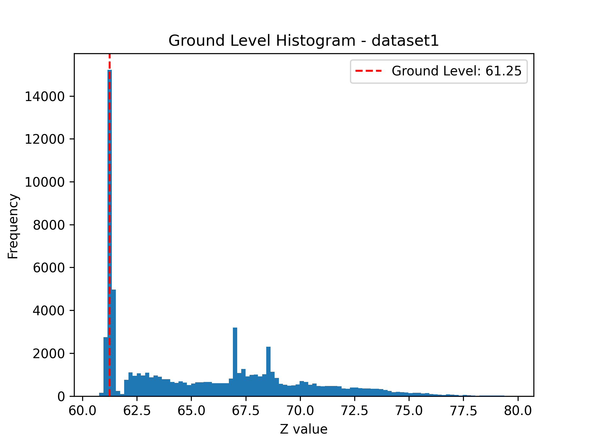
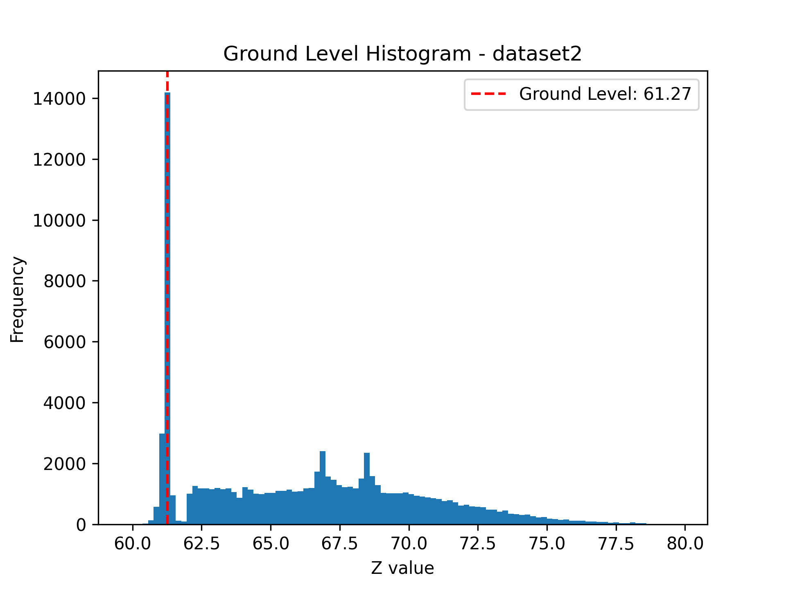
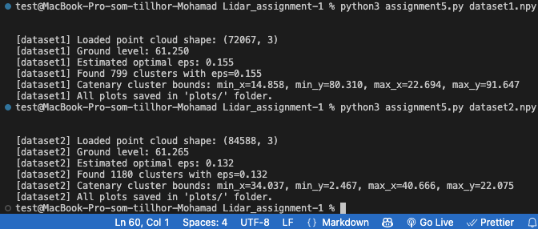
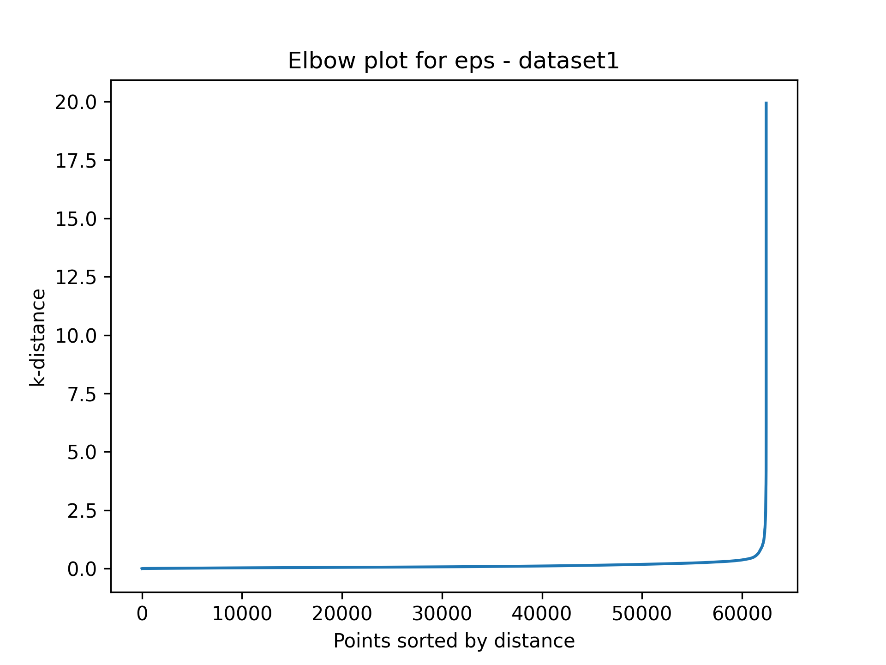
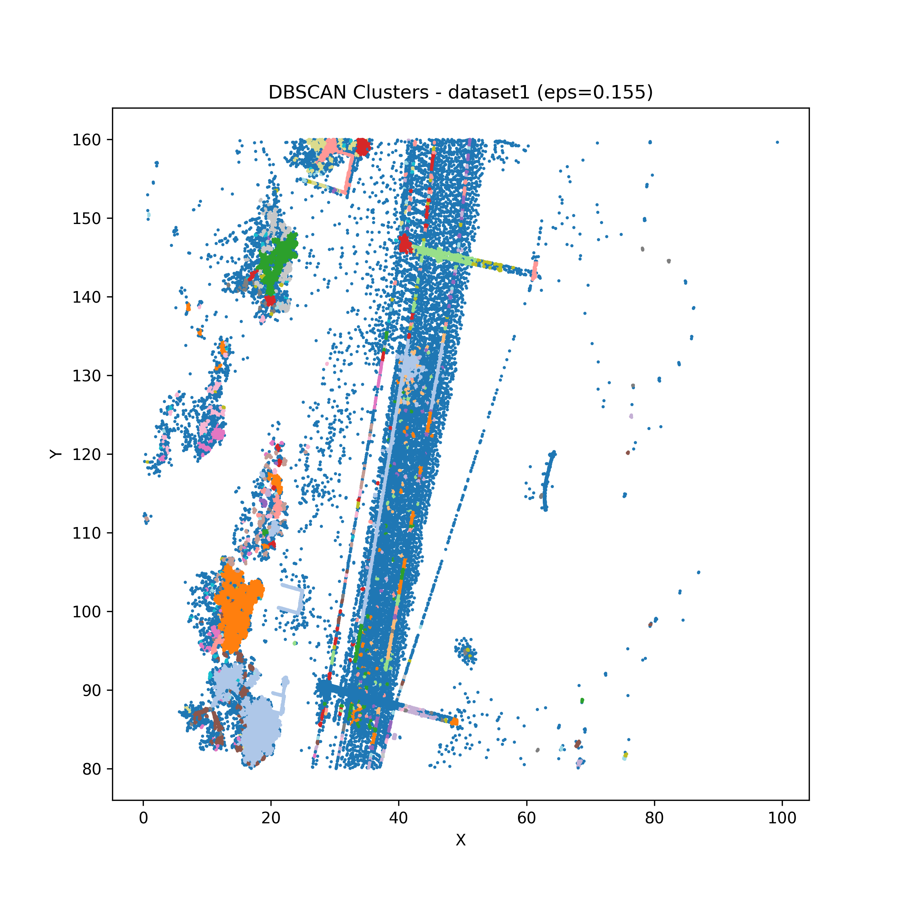
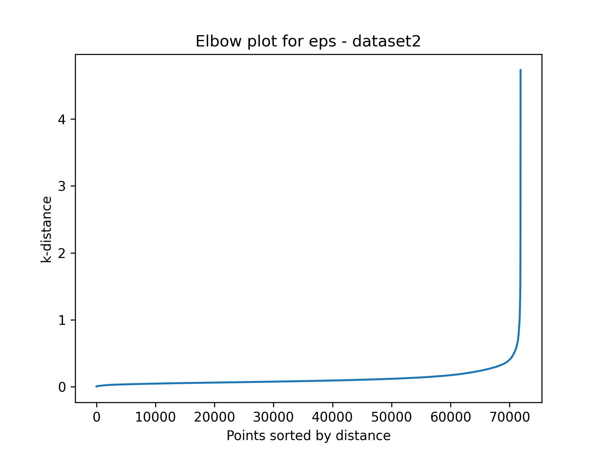
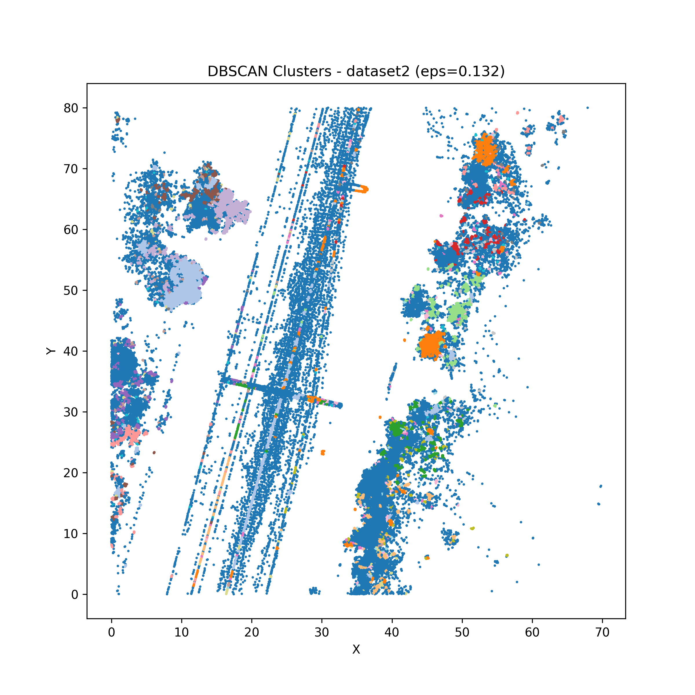

# Assignment 5 – LiDAR Data Processing #
**Name:** Mohamad Nweder  
**Course:** Industrial AI and eMaintenance - Part I: Theories & Concepts D7015B 55031 VT2025 
## GitHub Repository
The full project (code, plots, and documentation) is available at:  
[https://github.com/Nweder/Assignment5](https://github.com/Nweder/Assignment5)
--------------------------------------------------------------------

## Outcome
- Processing of raw LiDAR data using Python
- Application of ML methods (DBSCAN) and parameter tuning
- Documentation of results with plots

--------------------------------------------------------------------
## Task 1 – Ground Level Detection

The ground level was found using a histogram of Z-values and selecting the peak representing the ground.

### Dataset 1
- Ground level: 61.250

### Dataset 2
- Ground level: 61.265

--------------------------------------------------------------------

## Task 2 – Optimal Epsilon for DBSCAN

The optimal `eps` value was determined using the elbow (k-distance) method.

### Dataset 1
- Estimated optimal eps: 0.155  
- Number of clusters: 799

**Elbow plot:**

**Cluster plot:**

--------------------------------------------------------------------

### Dataset 2
- Estimated optimal eps: 0.132 
- Number of clusters: 1180

**Elbow plot:**

**Cluster plot:**

--------------------------------------------------------------------

## Task 3 – Largest Cluster (Catenary)

The largest cluster (excluding noise) was identified as the catenary.  
Bounding box coordinates (min/max X and Y) are reported below.

### Dataset 1
- **Bounds:**

--------------------------------------------------------------------